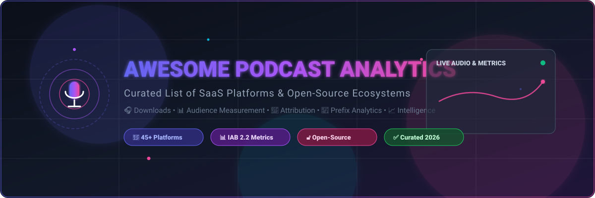

<p align="center">
  
</p>

<p align="center">
  <a href="https://github.com/ishandutta2007/Awesome-Awesome-Awesome"></a><a href="https://discord.gg/jc4xtF58Ve"></a>
  <a href="https://github.com/ishandutta2007/Awesome-Podcast-Analytics/stargazers"></a>
  <a href="https://github.com/ishandutta2007/Awesome-Podcast-Analytics/network/members"></a>
  <a href="https://github.com/ishandutta2007/Awesome-Podcast-Analytics/blob/main/LICENSE"></a>
  <a href="https://github.com/ishandutta2007/Awesome-Podcast-Analytics/pulls"></a>
  <a href="https://github.com/ishandutta2007"></a>
</p>

---

# 🎙️ Awesome Podcast Analytics 📊

> **A curated directory of top-tier SaaS platforms, hosted services, and open-source GitHub projects dedicated to podcast audience measurement, IAB-compliant download statistics, listener analytics, ad attribution, prefix tracking, distribution intelligence, and performance monitoring.**

Last updated: **September 2026** • Maintained by [@ishandutta2007](https://github.com/ishandutta2007)

---

## 📑 Table of Contents
- [📖 Overview](#-overview)
- [🏢 SaaS & Hosted Platforms](#-saashosted-platforms)
- [🔓 Open-Source GitHub Projects](#-open-source-github-projects)
- [🛠️ Architecture & Custom Systems](#️-architecture--custom-systems)
- [🤝 How to Contribute](#-how-to-contribute)
- [📈 Star History](#-star-history)
- [📜 Disclaimer](#-disclaimer)

---

## 📖 Overview

In the rapidly evolving digital audio space, understanding your listeners requires robust metrics and infrastructure. This repository tracks notable commercial SaaS/hosted platforms alongside powerful open-source tools.

### 🎯 Key Capabilities Covered:
- 📥 **Download & Stream Measurement**: IAB v2.2 certified metric calculations and raw HTTP log analysis.
- 👥 **Audience Intelligence**: Unique listener estimation, geographic breakdown, application and device telemetry.
- 🎯 **Ad Attribution & ROI**: Dynamic Ad Insertion (DAI), promo tracking, pixel attribution, and conversion funnels.
- 📡 **Prefix Analytics**: Transparent RSS prefix redirects (e.g., OP3) for host-independent measurement.
- 📈 **Publisher & Network BI**: Executive dashboards, multi-show aggregation, cohort analysis, and trend forecasting.

---

## 🏢 SaaS/Hosted Platforms

> 📊 **Sector Market Size & Dynamics:** The global podcasting industry is estimated at **$30–$40 Billion (2025–2026)** with podcast advertising accounting for **$16–$24 Billion** (projected to reach $45B+ by 2030 at ~25% CAGR). The podcast analytics and hosting sector is **moderately fragmented**—dominated at the high-volume streaming layer by mega-platforms (Spotify, Apple, YouTube), but sustained by a diverse ecosystem of independent hosting providers, prefix-based analytics networks, and third-party attribution suites due to the open nature of RSS.

*The table below is sorted by **Company Size / Valuation / Revenue** in descending order:*

| 🚀 Product | 💰 Company Size / Valuation / Revenue | 📝 Description | 🏷️ Starting Pricing | 🎁 Free Tier / Trial Limit |
|---|---|---|---|---|
| **[Spotify for Creators](https://podcasters.spotify.com/)** | **~$70B+ Market Cap** *(Spotify)* • ~$16B Annual Revenue | Podcast publishing and analytics platform providing creators with audience insights, episode performance, listener trends, consumption information, and Spotify distribution tools. | **$0/month** (100% Free) | **Free forever** with unlimited audio/video hosting, unlimited storage, unlimited bandwidth, and full analytics dashboard *(ad monetization requires 3 episodes, 2,000 consumption hours & 1,000 unique listeners in 30 days)*. |
| **[Megaphone](https://www.megaphone.fm/)** | **~$70B+ Market Cap** *(Spotify)* • ~$16B Annual Revenue | Enterprise podcast hosting and advertising platform providing distribution, monetization, audience analytics, and podcast advertising workflows. | Starts at **$99/month** *(Base publisher tier, scales with download impressions/CPM)* | **No permanent free tier**; access granted via guided enterprise product demo and pilot agreement. |
| **[Podsights](https://podsights.com/)** | **~$70B+ Market Cap** *(Spotify)* • ~$16B Annual Revenue | Podcast advertising measurement and attribution platform focused on campaign analytics, audience attribution, conversion measurement, and podcast advertising intelligence. *(Integrated into Spotify Ad Analytics)* | **$0** *(Free for Spotify advertisers)* / Custom attribution historically starting at ~$500/month | **Free forever** for verified audio ad campaign measurement on Spotify Ad Analytics without monthly caps. |
| **[Chartable](https://chartable.com/)** | **~$70B+ Market Cap** *(Spotify)* • ~$16B Annual Revenue | Podcast analytics and attribution platform known for download analytics, SmartLinks, attribution measurement, audience intelligence, and podcast marketing analytics. *(Service sunset in Dec 2024)* | Starts at **$20/month** *(Pro tier; previously offered $0 basic plan)* | **Free forever plan** supported up to 5,000 monthly downloads with basic analytics & SmartLinks. |
| **[Simplecast](https://simplecast.com/)** | **~$9B+ Market Cap** *(SiriusXM)* • ~$8.9B Annual Revenue | Podcast hosting and analytics platform providing download statistics, audience insights, distribution data, episode performance, and publishing workflows. | Starts at **$15/month** *(Basic plan; $135/year)* | **14-day free trial** with full platform access *(up to 20,000 downloads/month, unlimited storage, 2 team seats, no credit card required)*; no permanent free tier. |
| **[Captivate](https://www.captivate.fm/)** | **~£1.2B (~$1.5B+) Valuation** *(Global Media)* • ~$800M+ Revenue | Podcast hosting and analytics platform providing download statistics, listener insights, marketing tools, growth analytics, and podcast business features. | Starts at **$19/month** *(Personal plan; $17/month billed annually)* | **30-day free trial** with full platform features *(unlimited podcasts, unlimited storage, up to 30,000 monthly downloads)*; no permanent free tier. |
| **[Acast](https://www.acast.com/)** | **~$400M Market Cap** *(Nasdaq: ACAST)* • ~$190M Annual Revenue | Podcast hosting, distribution, advertising, and analytics platform supporting publishers, creators, and podcast networks. | Starts at **$14.99/month** *(Starter plan billed annually)* or $25/month | **Free forever ("Starter" plan)** limited to 1 podcast show and max 5 published episodes with basic analytics and distribution *(credit card required for verification)*. |
| **[Libsyn Stats](https://libsyn.com/)** | **~$65M Market Cap** *(Liberated Syndication)* • ~$35M Annual Revenue | Podcast hosting analytics platform providing download statistics, audience information, geographic reports, publishing analytics, and podcast performance reporting. | Starts at **$5/month** *(Libsyn 3hr plan)* to $12/month *(Basic with Advanced Stats)* | **30-day free trial** *(available via promo codes/new signups, with 3 to 6 hours monthly upload capacity)*; no permanent free tier. |
| **[Podbean](https://www.podbean.com/)** | **~$50M - $75M Est. Valuation** • ~$20M - $25M Annual Revenue | Podcast hosting platform with publishing tools, download statistics, audience analytics, monetization, and podcast distribution. | Starts at **$14/month** *(Unlimited Audio; $9/month billed annually)* | **Free forever ("Basic" plan)** with 5 hours (500 MB) total storage, 100 GB monthly bandwidth, max 3 episodes/day, 100 MB/file limit; **14-day free trial** on paid plans. |
| **[Buzzsprout](https://www.buzzsprout.com/)** | **~$35M - $50M Est. Valuation** • ~$15M - $20M Annual Revenue | Podcast hosting platform with download analytics, listener statistics, episode performance reporting, directories, and podcast publishing tools. | Starts at **$12/month** *(3 hours upload/month)* or $19/month *(6 hours upload/month)* | **90-day free trial plan** with 2 hours audio upload per month and standard analytics *(episodes expire and are removed from feed after 90 days)*; no credit card required. |
| **[RedCircle](https://redcircle.com/)** | **~$25M - $40M Est. Valuation** • ~$12M Raised • ~$5M+ Revenue | Podcast hosting and monetization platform offering audience analytics, distribution, advertising tools, subscriptions, and growth features. | Starts at **$12/month** *(Growth plan; $9/month billed annually)* | **Free forever ("Core" plan)** with 1 podcast per account, 200 MB/episode file limit, unlimited storage & bandwidth, and ad monetization; **7-day free trial** for paid plans. |
| **[Ausha](https://www.ausha.co/)** | **~$15M - $25M Est. Valuation** • ~$6M Raised • ~$4M+ Revenue | Podcast marketing and hosting platform providing analytics, audience intelligence, distribution tools, discoverability, and promotional workflows. | Starts at **$15/month** *(Launch plan; $13/month billed annually)* | **14-day free trial** with full access to Launch tier features *(1 podcast, unlimited episodes and storage, basic analytics)*; no permanent free tier. |
| **[Podtrac](https://www.podtrac.com/)** | **~$15M - $20M Est. Valuation** • ~$5M+ Annual Revenue | Podcast measurement and analytics provider offering audience measurement, download statistics, rankings, advertising measurement, and industry reporting. | Starts at **$20/month** *(Grow Your Show plan)* | **Free forever ("Getting Started" plan)** with unlimited downloads, unlimited shows, IAB-certified metrics, and demographic insights. |
| **[Blubrry Statistics](https://blubrry.com/)** | **~$10M - $15M Est. Valuation** • ~$4M+ Annual Revenue | Podcast analytics and hosting ecosystem offering podcast download statistics, audience measurement, publishing tools, and integration with podcast websites. | Starts at **$5/month** *(Standalone Standard Stats)* or $7/month *(Standard 1.5 Hosting)* | **Free forever Statistics tier** providing basic download and geolocation metrics; **30-day free trial** available for hosting plans. |
| **[Transistor Analytics](https://transistor.fm/)** | **~$10M - $15M Est. Valuation** • ~$3M ARR *(Bootstrapped)* | Podcast hosting platform with analytics for downloads, listener trends, episode performance, geographic distribution, podcast applications, and audience growth. | Starts at **$19/month** *(Starter plan; $190/year)* | **14-day free trial** with full access to all features *(unlimited podcasts, unlimited storage, advanced analytics, up to 20,000 downloads/month)*; no permanent free tier. |
| **[RSS.com](https://rss.com/)** | **~$8M - $12M Est. Valuation** • ~$3M - $5M Annual Revenue | Podcast hosting and distribution platform offering publishing tools, audience analytics, RSS feed management, and podcast performance reporting. | Starts at **$14.99/month** *(All-in-One Audio; $11.99/month billed annually, $4.99/mo for students)* | **Free forever plan** with unlimited episodes and storage, 1 podcast show, and access to the latest 30 days of analytics history *(credit card required for verification)*. |
| **[Podscribe](https://podscribe.com/)** | **~$8M - $15M Est. Valuation** • ~$3M+ Annual Revenue | Podcast intelligence and advertising measurement platform focused on monitoring, attribution, audience insights, brand measurement, and campaign analytics. | Starts at **$250/month platform fee** + $1.50 CPM for first 2M impressions | **No permanent free tier**; pilot testing and guided product demo available for qualified advertisers upon sales request. |
| **[Magellan AI](https://www.magellan.ai/)** | **~$8M - $12M Est. Valuation** • ~$3M+ Annual Revenue | Podcast advertising intelligence platform providing advertising market analysis, campaign monitoring, competitive intelligence, and podcast advertising insights. | Starts at **$500/month** *(Estimated starting intelligence tier / custom annual agreements)* | **No permanent free tier**; custom sandbox trial and guided demo available upon consultation with enterprise sales team. |
| **[Backtracks](https://backtracks.fm/)** | **Defunct / $0** *(Raised $4M; Ceased Ops May 2023)* | Podcast hosting and analytics platform focused on podcast intelligence, audience measurement, listener engagement, content analytics, and business podcasting. *(Service shut down in May 2023)* | Starts at **$39/month** *(Starter tier prior to shutdown)* / Enterprise custom | **14-day free trial** historically *(up to 10,000 downloads/month)*; no permanent free tier. |
| **[OP3](https://op3.dev/)** | **Open-Source Non-Profit** • $0 Commercial Valuation | Open and privacy-focused podcast prefix analytics service providing public podcast download metrics, request-level data, app and geographic information, and an API-driven analytics model. | **$0/month** (100% Free & Open-Source) | **Free forever** with unlimited podcasts, unlimited downloads, public web dashboards, and unrestricted REST API access. |

---

## 🔓 Open-Source GitHub Projects

*The open-source repositories below are sorted by **GitHub Star Count** in descending order. Click any badge to visit the repo's stargazers page:*

1. **[Elasticsearch](https://github.com/elastic/elasticsearch)** [](https://github.com/elastic/elasticsearch/stargazers)  
   Distributed search and analytics engine for indexing podcast transcripts, server access logs, listener metadata, and full-text audio content search.

2. **[Apache Superset](https://github.com/apache/superset)** [](https://github.com/apache/superset/stargazers)  
   Modern enterprise business intelligence platform suitable for building customizable podcast analytics dashboards, executive KPI charts, and listener retention reports.

3. **[Grafana](https://github.com/grafana/grafana)** [](https://github.com/grafana/grafana/stargazers)  
   Multi-platform open-source analytics and visualization web application for monitoring real-time podcast downloads, CDN bandwidth, and media server telemetry.

4. **[scikit-learn](https://github.com/scikit-learn/scikit-learn)** [](https://github.com/scikit-learn/scikit-learn/stargazers)  
   Core machine learning library in Python for listener segmentation, churn prediction, episode performance forecasting, and audience clustering.

5. **[Prometheus](https://github.com/prometheus/prometheus)** [](https://github.com/prometheus/prometheus/stargazers)  
   Systems monitoring and alerting toolkit ideal for tracking podcast audio delivery response times, request throughput, and streaming infrastructure health.

6. **[Pandas](https://github.com/pandas-dev/pandas)** [](https://github.com/pandas-dev/pandas/stargazers)  
   Powerful Python data analysis toolkit widely utilized for podcast log cleaning, IAB download filtering, user agent parsing, and demographic aggregation.

7. **[ClickHouse](https://github.com/ClickHouse/ClickHouse)** [](https://github.com/ClickHouse/ClickHouse/stargazers)  
   High-performance columnar analytical database management system capable of executing real-time SQL analytical queries over billions of raw podcast download events.

8. **[Metabase](https://github.com/metabase/metabase)** [](https://github.com/metabase/metabase/stargazers)  
   Intuitive open-source business intelligence and dashboard tool for sharing podcast download insights, cohort reports, and episode comparisons across teams.

9. **[Apache Spark](https://github.com/apache/spark)** [](https://github.com/apache/spark/stargazers)  
   Unified analytics engine for large-scale podcast log data processing, ad attribution calculations, and long-term historical audience modeling.

10. **[Apache Airflow](https://github.com/apache/airflow)** [](https://github.com/apache/airflow/stargazers)  
    Workflow orchestration platform designed to author, schedule, and monitor podcast data ingestion pipelines, daily syncs, and reporting jobs.

11. **[Polars](https://github.com/pola-rs/polars)** [](https://github.com/pola-rs/polars/stargazers)  
    Blazing-fast multi-threaded DataFrame library written in Rust and Python for high-throughput batch processing of podcast access logs and CSV exports.

12. **[DuckDB](https://github.com/duckdb/duckdb)** [](https://github.com/duckdb/duckdb/stargazers)  
    In-process SQL OLAP database management system for lightning-fast embedded analysis of local podcast log files, Parquet datasets, and export dumps.

13. **[Apache Kafka](https://github.com/apache/kafka)** [](https://github.com/apache/kafka/stargazers)  
    Distributed event-streaming platform for ingesting high-volume podcast download requests, ad tracking pings, and real-time streaming telemetry.

14. **[PostHog](https://github.com/PostHog/posthog)** [](https://github.com/PostHog/posthog/stargazers)  
    Open-source product analytics suite for tracking web player interactions, listener conversion funnels, subscription checkouts, and audience retention.

15. **[Umami](https://github.com/umami-software/umami)** [](https://github.com/umami-software/umami/stargazers)  
    Simple, fast, privacy-focused open-source analytics solution for measuring traffic on podcast websites, episode landing pages, and campaign URLs.

16. **[Apache Flink](https://github.com/apache/flink)** [](https://github.com/apache/flink/stargazers)  
    Stream-processing framework for low-latency real-time podcast download aggregation, anomaly detection, and concurrent listener calculations.

17. **[Matomo](https://github.com/matomo-org/matomo)** [](https://github.com/matomo-org/matomo/stargazers)  
    Leading open-source web analytics platform offering complete data ownership to track podcast landing pages, referrals, and campaign conversions.

18. **[Plausible Analytics](https://github.com/plausible/analytics)** [](https://github.com/plausible/analytics/stargazers)  
    Lightweight, cookie-free web analytics platform for privacy-friendly tracking of podcast show pages, marketing campaigns, and listener sources.

19. **[MLflow](https://github.com/mlflow/mlflow)** [](https://github.com/mlflow/mlflow/stargazers)  
    Open-source platform to manage the machine learning lifecycle for predictive podcast analytics models, listener classification, and forecasting.

20. **[GoAccess](https://github.com/allinurl/goaccess)** [](https://github.com/allinurl/goaccess/stargazers)  
    Real-time web log analyzer and interactive terminal/HTML viewer for parsing raw media-server access logs and tracking podcast MP3 downloads.

21. **[Audiobookshelf](https://github.com/advplyr/audiobookshelf)** [](https://github.com/advplyr/audiobookshelf/stargazers)  
    Self-hosted audiobook and podcast server with comprehensive playback tracking, session telemetry, listening duration analytics, and user statistics.

22. **[TimescaleDB](https://github.com/timescale/timescaledb)** [](https://github.com/timescale/timescaledb/stargazers)  
    Time-series SQL database built on PostgreSQL, optimized for tracking time-stamped podcast download trends, listener traffic, and performance over time.

23. **[Prefect](https://github.com/PrefectHQ/prefect)** [](https://github.com/PrefectHQ/prefect/stargazers)  
    Pythonic workflow coordination engine for automating podcast analytics data ingestion, API syncs with Spotify/Apple, and reporting pipelines.

24. **[PostgreSQL](https://github.com/postgres/postgres)** [](https://github.com/postgres/postgres/stargazers)  
    Standard open-source relational database widely used for storing podcast episode metadata, RSS feeds, download logs, and subscriber profiles.

25. **[OpenObserve](https://github.com/openobserve/openobserve)** [](https://github.com/openobserve/openobserve/stargazers)  
    Cloud-native observability and log search platform for ingesting high-throughput podcast CDN and streaming logs with low storage overhead.

26. **[Navidrome](https://github.com/navidrome/navidrome)** [](https://github.com/navidrome/navidrome/stargazers)  
    Modern self-hosted music and podcast streaming server with real-time playback telemetry, scrobbling metrics, and multi-user listener logs.

27. **[Jupyter Notebook](https://github.com/jupyter/notebook)** [](https://github.com/jupyter/notebook/stargazers)  
    Interactive computing ecosystem suitable for podcast exploratory data analysis, audience research notebooks, and custom visualization.

28. **[dbt Core](https://github.com/dbt-labs/dbt-core)** [](https://github.com/dbt-labs/dbt-core/stargazers)  
    Data transformation workflow tool for modeling raw podcast download events into IAB-standardized reporting tables and analytical marts.

29. **[Great Expectations](https://github.com/great-expectations/great_expectations)** [](https://github.com/great-expectations/great_expectations/stargazers)  
    Data-quality framework to test and validate podcast analytics datasets, catching corrupted logs, duplicate events, and schema anomalies.

30. **[OpenSearch](https://github.com/opensearch-project/OpenSearch)** [](https://github.com/opensearch-project/OpenSearch/stargazers)  
    Community-driven search and analytics suite for indexing podcast audio metadata, user agents, transcripts, and request logs.

31. **[AntennaPod](https://github.com/AntennaPod/AntennaPod)** [](https://github.com/AntennaPod/AntennaPod/stargazers)  
    Open-source podcast manager and player for Android offering local playback statistics, listening duration insights, and feed health telemetry.

32. **[Countly](https://github.com/Countly/countly-server)** [](https://github.com/Countly/countly-server/stargazers)  
    Product analytics platform for mobile and web apps, ideal for tracking custom podcast applications, embedded audio players, and listener events.

33. **[Apache NiFi](https://github.com/apache/nifi)** [](https://github.com/apache/nifi/stargazers)  
    Automated dataflow platform useful for collecting, routing, and transforming podcast analytics data across APIs, RSS servers, and data lakes.

34. **[Ackee](https://github.com/electerious/Ackee)** [](https://github.com/electerious/Ackee/stargazers)  
    Self-hosted, Node.js-based analytics tool for tracking visitors and page views across podcast promotional websites without invasive tracking.

35. **[Castopod](https://github.com/podlibre/castopod)** [](https://github.com/podlibre/castopod/stargazers)  
    Full-featured open-source self-hosted podcast hosting platform with built-in IAB-compliant analytics, Fediverse social integration, and listener tracking.

36. **[audiowaveform](https://github.com/bbc/audiowaveform)** [](https://github.com/bbc/audiowaveform/stargazers)  
    C++ program to generate audio waveforms and peak data from podcast audio files for media player visualization and engagement heatmaps.

37. **[gPodder](https://github.com/gpodder/gpodder)** [](https://github.com/gpodder/gpodder/stargazers)  
    Simple, open-source podcast client and sync engine with download management, episode archiving, and playback statistics.

38. **[Open Web Analytics](https://github.com/padams/Open-Web-Analytics)** [](https://github.com/padams/Open-Web-Analytics/stargazers)  
    Open-source web analytics framework for tracking podcast audience web conversions, episode plays, and campaign referrals.

39. **[Shynet](https://github.com/mbecker/shynet)** [](https://github.com/mbecker/shynet/stargazers)  
    Modern, privacy-respecting analytics tool that works without cookies, perfect for podcast landing pages and episode marketing campaigns.

40. **[AWStats](https://github.com/eldy/awstats)** [](https://github.com/eldy/awstats/stargazers)  
    Mature log analysis tool that parses media server access logs to extract unique visitors, podcast audio downloads, user agents, and referrers.

41. **[OP3 (Open Podcast Prefix Project)](https://github.com/johnspurlock/op3)** [](https://github.com/johnspurlock/op3/stargazers)  
    The premier open-source podcast prefix redirect service providing public, privacy-focused, auditable download statistics and real-time API access.

42. **[Open Podcast Stack](https://github.com/openpodcast/stack)** [](https://github.com/openpodcast/stack/stargazers)  
    Self-hosted open podcast analytics stack combining an API, RSS forwarder, Spotify/Apple connectors, MySQL, and Metabase for custom measurement.

43. **[Open Podcast Pipelines](https://github.com/openpodcast/pipelines)** [](https://github.com/openpodcast/pipelines/stargazers)  
    Open-source data pipelines for collecting and processing podcast metrics from Spotify, Apple Podcasts, Podigee, and Anchor into Open Podcast API.

44. **[Open Podcast API](https://github.com/openpodcast/api)** [](https://github.com/openpodcast/api/stargazers)  
    REST API backend for aggregating and querying multi-platform podcast analytics and listener metrics.

45. **[Podcast Analytics Dashboard](https://github.com/openpodcast/podcast-analytics-dashboard)** [](https://github.com/openpodcast/podcast-analytics-dashboard/stargazers)  
    Open-source dashboard project tracking podcast downloads and streams across Spotify, Apple Podcasts, and YouTube with CSV exports and comparisons.

46. **[OP3 MCP](https://github.com/johnspurlock/op3-mcp)** [](https://github.com/johnspurlock/op3-mcp/stargazers)  
    Open-source Model Context Protocol (MCP) server that exposes OP3 podcast analytics directly to AI assistants and autonomous coding agents.

---

## 🛠️ Architecture & Custom Systems

Building a self-hosted, privacy-first, and IAB-compliant podcast analytics stack can be achieved by combining modular open-source components:

```
[Podcast RSS Feed] ──> [OP3 Prefix / Forwarder] ──> [Media Storage CDN]
                              │
                              ▼
                     [Apache Kafka / Flink] (Real-time Stream)
                              │
                              ▼
                     [ClickHouse / TimescaleDB] (OLAP Storage)
                              │
                              ▼
                     [Metabase / Superset / Grafana] (Dashboard & BI)
```

1. **Measurement Layer**: Use **[OP3](https://github.com/johnspurlock/op3)** or **[Castopod](https://github.com/podlibre/castopod)** as an open podcast download analytics layer.
2. **Pipelines & Ingestion**: Utilize **[Open Podcast Pipelines](https://github.com/openpodcast/pipelines)**, **[Apache Airflow](https://github.com/apache/airflow)**, or **[Prefect](https://github.com/PrefectHQ/prefect)** to aggregate analytics across Apple Podcasts, Spotify, and RSS logs.
3. **Storage & Processing**: Store high-throughput download requests in **[ClickHouse](https://github.com/ClickHouse/ClickHouse)**, **[TimescaleDB](https://github.com/timescale/timescaledb)**, or **[DuckDB](https://github.com/duckdb/duckdb)**.
4. **Visualization**: Build executive dashboards with **[Metabase](https://github.com/metabase/metabase)**, **[Apache Superset](https://github.com/apache/superset)**, or **[Grafana](https://github.com/grafana/grafana)**.
5. **Web Traffic & Funnels**: Track episode show-notes and acquisition funnels with **[Matomo](https://github.com/matomo-org/matomo)**, **[Plausible](https://github.com/plausible/analytics)**, or **[Umami](https://github.com/umami-software/umami)**.

---

## 🤝 How to Contribute

Contributions are warmly welcome! To propose new SaaS platforms or open-source projects:

1. 🍴 **Fork** this repository.
2. 🌿 **Create a branch**: `git checkout -b add-my-tool`
3. 📝 **Add/edit entries** in `README.md` following the established tabular or starred format.
4. 🔍 Ensure all descriptions are concise, links are valid, and pricing/star counts are accurate.
5. 🚀 **Submit a Pull Request** with a brief summary of the addition.

---

## 📈 Star History

[](https://star-history.dera.page/#ishandutta2007/Awesome-Podcast-Analytics&type=date&legend=top-left)

---

## 📜 Disclaimer

This repository is community-curated for informational and educational purposes. Podcast download metrics, audience estimates, and ad attribution methodologies may vary across hosting providers and analytics engines. Independent verification is recommended for commercial ad buying or financial commitments.

---

<p align="center">
  <b>⭐ Star this repository if you find it helpful!</b><br/>
  Discover more curated lists at <a href="https://github.com/ishandutta2007/Awesome-Awesome-Awesome">Awesome-Awesome-Awesome</a>.
</p>
